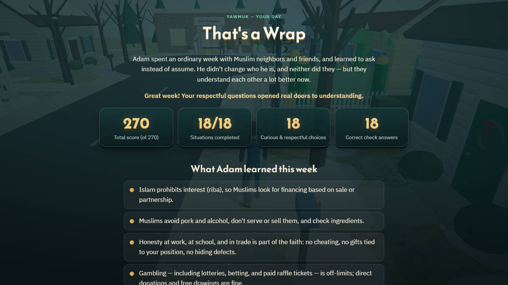
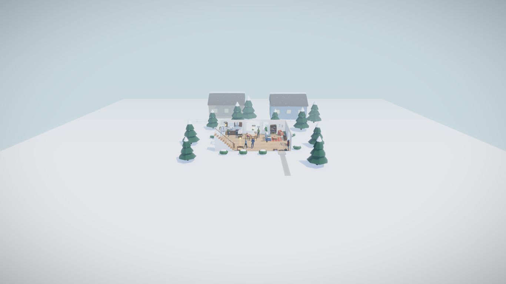
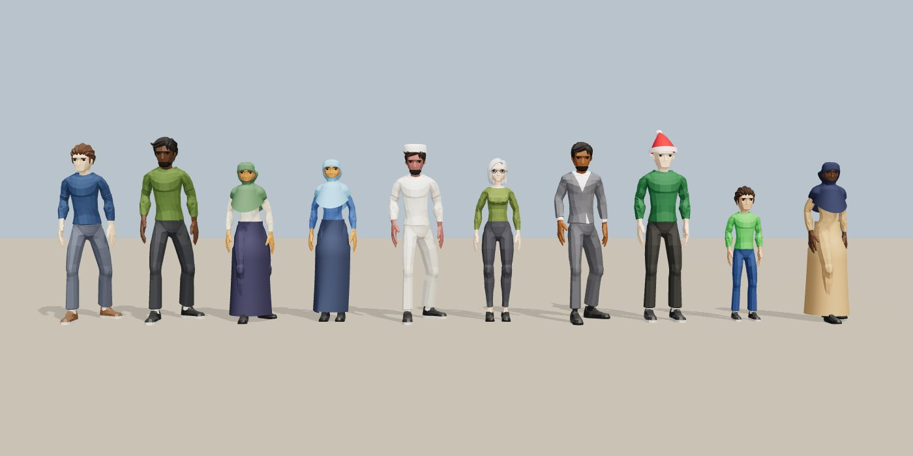

<div dir="rtl">

# «يومك» — Yawmuk

**لعبة ثلاثية الأبعاد في المتصفح تعرّف بأحكام الإسلام في المعاملات اليومية من خلال أسبوع عادي في حياة «آدم» في أمريكا، مع أدلة موثّقة ومراجعة آلية للنصوص وإحالة دائمة إلى العالم.**

| | |
|---|---|
| 🎮 **التجربة المباشرة · Live demo** | `<LIVE_URL_TBD>` |
| 🎬 **الفيديو (دقيقتان) · Video** | `<VIDEO_URL_TBD>` |
| 📑 **العرض التقديمي · Deck (PDF)** | `<DECK_TBD>` |
| 💻 **المستودع · Repo** | https://github.com/B4r4k4/yawmuk |
| 🧭 **المسار · Track** | **03 — التجارب التفاعلية (Interactive experiences)** |

> ⚠️ **حالة المراجعة:** الأحكام الثمانية عشر **مسودات أعدّها الذكاء الاصطناعي وراجعها آلياً**، وهي **بانتظار مراجعة عالم بشري**؛ لم يراجعها أي عالم بعد. نصوص الآيات والأحاديث طوبقت آلياً حرفاً بحرف مع مصادرها (انظر [سجل المصادر](docs/SOURCES.md))، أما الإحالات المذهبية والمعاصرة فلم تُطابَق كلها على المطبوع. اللعبة أداة تعليمية **وليست فتوى**. وللمسلم في حالته الخاصة: اسأل عالماً موثوقاً أو إمام مسجدك.

</div>

> ⚠️ **Review status:** all 18 rulings are **AI-prepared drafts that passed automated checks; they are pending scholarly review and have not been reviewed by a human scholar.** Every Quran and hadith text was machine-matched letter by letter against its source ([source log](docs/SOURCES.md)). Madhhab and contemporary references are attributed but most were not matched page by page against printed editions. The game is an educational tool, **not a fatwa**. A Muslim with a question about their own situation should ask a trusted scholar or their local imam.

**Yawmuk («يومك», "your day")** is a browser 3D game that explains what Islam says about everyday dealings (money, food, work, study, celebrations) through an ordinary week in Columbus, Ohio. It runs on desktop and phone, in Arabic (RTL) and English, with no install and no account.

---

## Problem · المشكلة

- People meeting Islam for the first time, and many Muslims in the West, run into everyday questions (a mortgage, a 401(k), a work party with alcohol, a lost wallet, a raffle) that most Islamic content answers either as **long text fatwas** or as **short, unsourced social-media clips**.
- Generic AI chatbots answer fast but **invent hadiths, flatten scholarly disagreement and never say "ask a scholar"**.
- Existing apps are mostly Q&A lists: nothing lets a learner *experience* the situation, see how Muslims actually handle it, and then read the evidence.

## Solution · الحل

An interactive 3D story. The player is **Adam Reed**, a 28-year-old software engineer learning about Islam through his Muslim neighbours, coworkers and friends (his guide is his neighbour Omar). At each stop a friend does something that raises a question; the player chooses how Adam asks and responds, then a **ruling card** shows:

- the verdict and an **"In plain words"** explanation for a newcomer;
- the evidence: **Quran** (verbatim, verified), **hadith** (verbatim, with number, grade and link), the **four madhhabs** side by side, and **contemporary fiqh councils** (IIFA, MWL, AMJA, FCNA, ECFR);
- practical guidance, halal alternatives and **when to ask a scholar**.

The score rewards curious, respectful questions and penalises stereotypes or pressure. The end screen shows what Adam learned, a suggested next topic and an invitation to a local mosque open house. **No pressure, no question about the player's beliefs, nothing about them stored.**

## How it works — five stations of a session · آلية العمل في خمس محطات

| # | Station | What happens |
|---|---|---|
| 1 | **Plan the journey** · خطة الرحلة | The player says (in a few taps or a short sentence) what they are curious about. The **AI journey planner** returns an ordered route through the 18 situations as validated JSON; with no API key, or if validation fails, a deterministic planner builds the route from the same catalogue. `?arm=fixed` forces the fixed route (for measurement). |
| 2 | **Live the situation** · عِش الموقف | Walk the 3D scene (WASD / joystick), meet the animated character, read the dialogue (fiction only: no scripture in the script files). |
| 3 | **Choose** · اختر | Pick how Adam responds; choices are shuffled; immediate feedback on the consequence. |
| 4 | **Read the ruling card** · بطاقة الحكم | Verdict, plain words, Quran, hadith, madhhabs, councils, guidance, "ask a scholar when…". The optional **"Ask about this situation"** panel answers only from this ruling's verified sources, or abstains and refers. |
| 5 | **Check & continue** · تحقق وتابع | A check question (+5), then the next station; at the end: what Adam learned, the next topic and a mosque referral. Progress is saved locally so the player can resume. |

### The six locations and 18 situations · المواقع الستة والمواقف الثمانية عشر

| Location · الموقع | Situations · المواقف |
|---|---|
| 🏠 Home · البيت | Mortgage vs Islamic financing · Supermarket meat, gelatin, alcohol in flavourings · Credit cards & BNPL |
| 💼 Work · العمل | Serving alcohol/pork at a side job · 401(k) & employer match · Vendor gifts, timesheets, company resources |
| 🎓 College · الكلية | Cheating & AI-written assignments · Interest-bearing student loan · Mixed study groups & handshakes |
| 🌃 Street · الشارع | Lost wallet (luqata) · Lottery, scratch cards, sports betting · Hidden defects, tips, fake reviews |
| 🎉 Office holiday party · حفلة الشركة | Holiday greetings · A table where alcohol is served · Charity raffle |
| 💍 Neighbours & a wedding · الجيران والعرس | A Muslim friend's wedding · Death of a non-Muslim neighbour · Gifts & a child's birthday party |

### Controls · التحكم

- **Desktop:** WASD / arrows to move, Shift to run, drag to orbit, wheel to zoom, **E** to interact, Esc for the menu.
- **Phone:** virtual joystick, drag to look, the **Interact** button.
- "Try another choice" replays a situation; the "Understanding" score keeps your best. The exit opens once a location is done.

## Screenshots · لقطات

| Start (AR) | Dialogue & choices (EN) | Ruling card (AR) |
|---|---|---|
|  |  |  |
| **Quran evidence (EN)** | **Four madhhabs (AR)** | **End screen (EN)** |
|  |  |  |
| **Home scene** | **Animated characters** | **Phone (390×844, AR)** |
|  |  |  |

More: [`docs/phase-4/screenshots/`](docs/phase-4/screenshots/) (UI before/after, every scene) and [`docs/phase-3/screenshots/`](docs/phase-3/screenshots/) (automated playthrough).

## The role of AI · دور الذكاء الاصطناعي

Full write-up: **[docs/AI.md](docs/AI.md)**. In short:

1. **AI journey planner** (`src/engine/planner.js` → Netlify Function in `netlify/functions/` → Claude). The function sends the learner's stated interest plus the fixed situation catalogue; Claude must return **structured JSON** (situation ids + one-line reasons). The response is **validated** (known ids only, no duplicates, length limits, no free religious text). Invalid output, a timeout or a missing `ANTHROPIC_API_KEY` → a **deterministic fallback** planner. The key never reaches the browser.
2. **Constrained "Ask" panel.** Retrieval is limited to the current ruling and its entries in the source log. The model may only cite ids it was given; every citation is checked against `content/sources.json` before display. When nothing retrieved covers the question, or the question is personal / high-stakes, it **abstains and refers to a scholar**. No Quran or hadith text is ever generated: quotations come only from the verified JSON.
3. **AI in building the content** (offline, before release): research agents drafted the rulings, an independent audit agent re-fetched and matched every ayah and hadith, and the tests in `tests/` act as the evaluation suite (abstention, attribution, no fabricated hadith). See [Content & sourcing methodology](#content--sourcing-methodology--منهجية-المحتوى-والتوثيق).

## Content reliability · موثوقية المحتوى

How to verify any claim yourself: [docs/SOURCES.md](docs/SOURCES.md) ("How to verify" + every source with its link and status). Question bank used to test the AI panel, including the critical safety cases: [docs/QA_BANK.md](docs/QA_BANK.md).

Every piece of religious content is classified using the **four content levels of the challenge's scientific reference package** (`content_level` on each ruling, `level` on each Q&A item), and the game handles each the way the package requires:

| Level | Scope (per the package) | How the game handles it |
|---|---|---|
| **A — Stable foundational information** | Quran, authentic hadith, pillars of Islam and iman, basic seerah, ethics and values | Direct answer with its source: ayat quoted verbatim from the King Fahd Complex text via QuranEnc (`english_saheeh` translation), hadith with collection/number, grade and grader (dorar.net / HadeethEnc). Never paraphrased or generated. |
| **B — Explanation and reasoning** | Explaining concepts, maqasid, general questions and common misconceptions | Answer from the reviewed material with the reference shown; no categorical wording where scholars may differ. Our own reasoning is rendered separately as «شرح توضيحي — ليس نصاً شرعياً». |
| **C — Scholarly disagreement / high sensitivity** | Fiqh khilaf, detailed creed questions, contested history | Restricted answer: the verdict is `disputed`/`depends` or carries an explicit scope ("majority view"); the four madhhab positions are shown side by side with attribution; consensus is only claimed with a cited source; references not yet matched show «المرجع قيد التحقق». |
| **D — Fatwa or personal case** | A ruling on an individual's own situation, contracts, family disputes, legal/medical matters | **No independent ruling**: general information only plus referral (`refer_to_scholar_when` on every card; the Ask panel pre-filters personal questions and refers to a scholar / local imam). |

The AI never answers outside the reviewed material: if no source covers a question it abstains and refers.

Verification tooling: `npm run audit` re-fetches every ayah and six-book hadith and checks every link; `npm test` enforces the rules above (no scripture in the script files, no unverified hadith, `refer_to_scholar_when` on every ruling, no claim of scholar review).

## Privacy · الخصوصية

- **No account, no sign-in, no server-side profile.** The game never asks about the player's religion or beliefs and stores nothing about them.
- `localStorage` only: `yawmuk.progress.v1` (situation ids done, points, best choice) and `yawmuk.quality` (graphics preset). No cookies, no session storage, no IndexedDB.
- What the player types for the journey planner or the Ask panel is sent to the Netlify Function only for that request and is not logged or stored by the app.
- **Optional, anonymous metrics** (completion, check-question answers, planner arm) are sent only after the player explicitly consents; no identifiers and no free text.
- External requests: Google Fonts, and the Netlify Function when AI is used.

## Setup & run · التشغيل

Requires **Node.js 22+**.

```bash
npm ci                 # install exact locked dependencies
npm run dev            # http://localhost:5173  (?scene=home&nointro=1&lang=en&debug=1 to jump in; ?arm=fixed for the fixed route)
npm test               # unit, content-contract and safety tests (node:test, no browser)
npm run audit          # re-verify every Quran/hadith text against its source + check every link (needs network)
npm run build          # -> dist/ (static, base './')
npm run serve:dist     # serve dist/ at http://127.0.0.1:4173
npm run test:e2e       # headless Chrome playthrough of all 18 situations, AR+EN, desktop+phone
npm run sources        # regenerate docs/SOURCES.md from content/sources.json
```

The game works fully without an API key (deterministic planner, Ask panel shows the card's sources and the referral). To try the AI features locally: `ANTHROPIC_API_KEY=... npx netlify dev`.

### Deploy to Netlify · النشر

1. Netlify → **Add new site → Import an existing project** → GitHub → `B4r4k4/yawmuk`.
2. Build settings come from `netlify.toml`: build command `npm run build`, publish directory `dist`, functions directory `netlify/functions`.
3. **Site configuration → Environment variables:** `ANTHROPIC_API_KEY` = your key (scoped to Functions) and `NODE_VERSION` = `22`.
4. Deploy, then open the site and check: start screen, one full situation, the ruling card, the Ask panel (and its abstain case), the end screen.

No secrets are committed: the key exists only in Netlify's environment.

### What the tests cover

| Suite | File | What it checks |
|---|---|---|
| Content contract | `tests/content.test.mjs` | The 18 ids match the catalogue in `docs/TEAM_BRIEF.md` and the engine; every ruling and script field exists in both languages (including `newcomer_explainer`); script and UI text stay on Islam only; README links resolve; one `best` choice per situation; one correct check answer; the location chain ends. |
| Safety | `tests/safety.test.mjs` | Every ayah has surah/ayah, verbatim text, translation and a source link, and is verified in the source log; every hadith has collection, number, narrator, grade and source; **no unverified hadith**; every ruling has `refer_to_scholar_when`; `review_status` never claims scholar review; **no script file contains Quran or hadith text**; the ruling card **abstains** ("text not provided") rather than inventing, renders citations verbatim, and never renders unsafe links. |
| Citation audit | `tests/audit.test.mjs` | Runs `tools/audit/verify.mjs` (letter-by-letter re-check of every ayah and six-book hadith); skipped with a message when offline with no cache. |
| End to end | `tests/e2e/playthrough.mjs` | Plays the whole week 4 times (AR/EN × desktop/phone) in headless Chrome: reachability of every hotspot, dialogue, choices, ruling card vs JSON, check question, resume after reload, end screen, RTL overflow and privacy (only the keys above in storage). |

## Architecture · البنية

```
index.html, src/main.js           boot
src/engine/                       game engine (Three.js r170, Vite 6) — see src/engine/README.md
  game.js                         flow: start → plan → intro → 6 locations → summary; window.yawmuk debug API
  planner.js                      journey planner client: calls the Netlify Function, validates, deterministic fallback
  sceneManager.js, sceneRegistry.js  scene contract, markers/NPCs, camera occluders, disposal
  assets.js                       async glTF (meshopt) / PBR / HDRI loading + public/assets/catalog.json
  characters.js, accessories.js   animated Quaternius characters; hijab, kufi, beard, clothing generated at runtime
  events.js                       engine event bus
  player.js, input.js, world.js   third-person player, keyboard/mouse/touch, renderer, HDRI + post-processing
  content.js, progress.js         content loaded at build time; localStorage progress
  ui/                             dialogue, ruling card (textContent only), screens, HUD, loader, credits
src/scenes/<location>.js          six scenes (procedural architecture + curated assets)
netlify/functions/                serverless AI endpoint (Claude); holds the API key server-side
content/rulings/<location>.json   the rulings: the ONLY place religious content lives
content/script/<location>.json    the story: dialogue, choices, check questions (no Quran/hadith text)
content/sources.json              unified source log → docs/SOURCES.md
public/assets/                    curated CC0/CC-BY glTF props, HDRIs, PBR textures, animated characters (+ LICENSES.md)
tools/audit/                      citation checker, link checker, source-log builders
tools/assets/, tools/characters/  asset fetch/measure/catalogue; character fetch + merge + meshopt build
tools/serve.mjs                   zero-dependency static server for dist/
tests/                            node:test suites + e2e playthrough
docs/                             team brief, AI, sources, QA bank, assets, research, audits, deck outline, video script
reports/phase-N.pdf               phase reports
```

Principles enforced in code and tests:
1. **Story and ruling are separate.** Dialogue is fiction; rulings and evidence come only from `content/rulings/` and are rendered without changing a word.
2. **No fabrication.** Quran and hadith are quoted only verbatim from a verified source; otherwise the field stays empty, the card says "not provided" and the reason goes to `notes_for_reviewer`.
3. **No pressure:** the game never pushes, ranks or tracks belief.
4. **Disagreement shown honestly:** the four madhhabs side by side, plus contemporary councils.
5. **Referral:** every ruling says when to ask a scholar; the end screen points to a local mosque.
6. **Arabic RTL and English** throughout.

## Content & sourcing methodology · منهجية المحتوى والتوثيق

1. **Research agents** wrote each ruling from primary sources: the Quran (Uthmani text, Saheeh International translation), hadith (sunnah.com, dorar.net, with number and grade), the relied-upon books of each madhhab or the Kuwaiti Fiqh Encyclopedia, and contemporary council resolutions. Notes: `docs/research/`.
2. **An independent audit agent** ([`docs/audit/phase1_audit.md`](docs/audit/phase1_audit.md)) re-fetched every ayah and every six-book hadith and compared them **letter by letter, with harakat**; hadiths outside the six books were matched by hand and logged in `tools/audit/manual_verifications.json`.
3. **The source log** ([`docs/SOURCES.md`](docs/SOURCES.md)) lists every source with its status. At the time of writing: 212 sources, 92 verified (all Quran and hadith texts plus 7 contemporary resolutions) and 120 that still need a human (madhhab page references and most fatwas).
4. **The scriptwriter** never writes scripture; situations point to a `ruling_id`, and the tests enforce this.
5. **Review status:** `ai_verified` (14 rulings) = passed automated checks with no substantive error found; `ai_draft` (4: food ingredients, alcohol/pork job, wedding, gifts/birthday) = open questions for a scholar. Both show in the game as **"pending scholar review"**. Only a human scholar may change this.

## Sources, tools & licences · سجل المصادر والأدوات والتراخيص

**Code licence:** [MIT](LICENSE) — © 2026 Yawmuk team (Lemonada). **Content** (`content/`, docs and reports): CC BY-NC-SA 4.0. Quran and hadith texts remain under their publishers' terms. Details and third-party notes: [`LICENSE`](LICENSE).

| Kind | Item | Version | Licence |
|---|---|---|---|
| Runtime | three | 0.170.0 | MIT |
| Runtime | postprocessing | 6.39.5 | Zlib |
| Runtime | n8ao | 2.0.1 | ISC |
| Runtime (function) | @anthropic-ai/sdk | 0.131.0 | MIT |
| Dev | vite | 6.4.3 | MIT |
| Dev | puppeteer-core (e2e) | 25.12.0 | Apache-2.0 |
| Dev | @gltf-transform/core, extensions, functions | 4.5.1 | MIT |
| Dev | meshoptimizer | 1.3.0 | MIT |
| Fonts | Amiri, Amiri Quran, IBM Plex Sans Arabic, Reem Kufi (Google Fonts) | — | SIL OFL 1.1 |
| 3D assets | 253 catalogued assets: 242 CC0 1.0 (Kenney, Poly Haven HDRIs and PBR textures, poly.pizza authors) + **11 CC-BY 3.0** models | — | [`public/assets/LICENSES.md`](public/assets/LICENSES.md), [`docs/ASSETS.md`](docs/ASSETS.md) |
| Characters | Quaternius Ultimate Modular Men/Women (6 source models, 6 clips) | — | CC0 1.0, [`public/assets/characters/LICENSES.md`](public/assets/characters/LICENSES.md) |
| Religious sources | quran.com, Tanzil, QuranEnc (Saheeh International), sunnah.com, dorar.net, hadith-api, madhhab books, IIFA/MWL/AMJA/FCNA/ECFR | — | cited per entry in [`docs/SOURCES.md`](docs/SOURCES.md) |
| AI (runtime) | Claude (Anthropic API) via Netlify Function | — | API terms; key server-side only |
| AI (building) | Claude Code agents (Claude Opus): supervisor, fiqh researchers, scriptwriter, scene builders, auditor, QA, docs | — | — |

All CC-BY models are credited in the in-game **Credits** screen (start screen and menu), which is generated at build time from `public/assets/LICENSES.md`.

**Baseline / prior work: none.** The repository was created on 2026-10-05 (first commit `be85b1f`); all code, content and assets integration were done during the hackathon window.

## Team · الفريق

Team **Lemonada**, working with a team of AI agents coordinated by a supervisor agent under the contracts in [`docs/TEAM_BRIEF.md`](docs/TEAM_BRIEF.md):

| Agent | Output |
|---|---|
| Supervisor | brief, contracts, coordination |
| Fiqh research (×3) | `content/rulings/*.json`, `docs/research/*` |
| Scriptwriter | `content/script/*.json`, `docs/story_bible.md`, `docs/hotspots.md` |
| Engine | `src/engine/**`, characters, assets pipeline, build |
| Scene builders (×6) | `src/scenes/*.js` |
| Independent sharia auditor | `tools/audit/*`, `content/sources.json`, `docs/audit/*` |
| AI features | planner, Netlify Function, Ask panel, `docs/AI.md` |
| Integration & QA | `tests/**`, `docs/QA_BANK.md`, `docs/phase-3/qa_report.md` |
| Documentation | `reports/phase-*.pdf`, this README, deck outline, video script |

## Measurement plan · خطة القياس

| Metric | Target | How |
|---|---|---|
| Journey completion | **≥ 70%** of players who start finish their route | opt-in anonymous event at start/end |
| Next-step clarity | **≥ 75%** answer "yes, I know what to do / whom to ask" on the end screen | one-tap end-screen question |
| Critical safety cases | **100%** abstain-and-refer on the critical cases in [docs/QA_BANK.md](docs/QA_BANK.md) | automated eval before every release |
| Understanding gain | measurable pre/post gain | check question per situation + a 3-question pre/post quiz |
| Personalised vs fixed | planner route vs `?arm=fixed` on completion and understanding | A/B by URL arm, compared on the same metrics |

## Roadmap & continuity · خطة الاستمرار

1. **Adoption by a da'wah / Islamic centre** that hosts the game, owns the content and uses it at open houses, new-Muslim classes and MSA events.
2. **Scholar review workflow (first priority):** a qualified scholar reviews the 18 rulings (the 4 `ai_draft` first, using the prioritised list in the audit), checks madhhab references against printed editions and signs off; approved rulings get `review_status: "scholar_reviewed"` with name and date, and the safety tests whitelist them.
3. **More situations** with the same pipeline (research → audit → script → scene → tests): healthcare, travel, inheritance basics, online business.
4. **Ramadan week:** fasting at work, an iftar invitation, zakat al-fitr, Eid with the neighbours.
5. **More languages** (Urdu, French, Spanish, Somali), audio narration, screen-reader flow for the 3D parts, a teacher mode.
