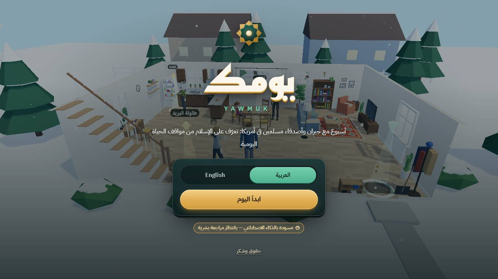
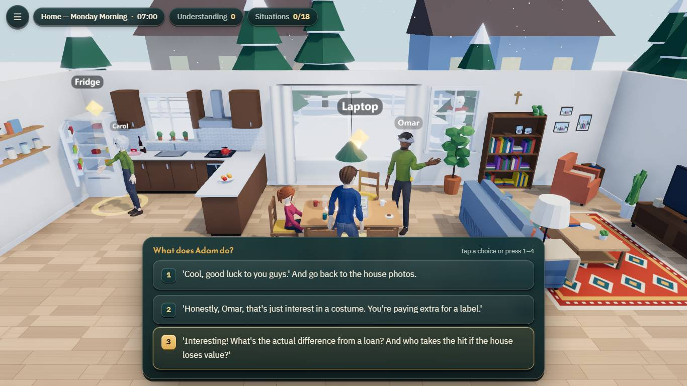
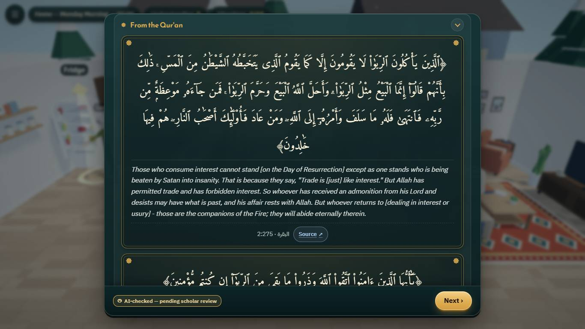
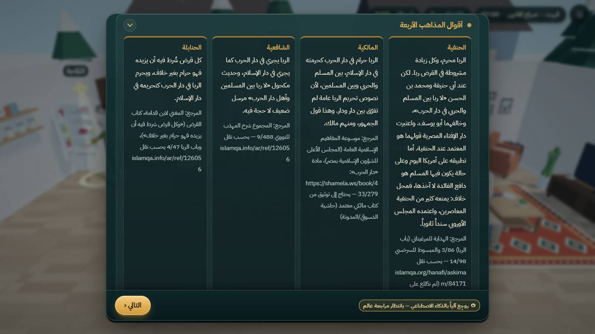
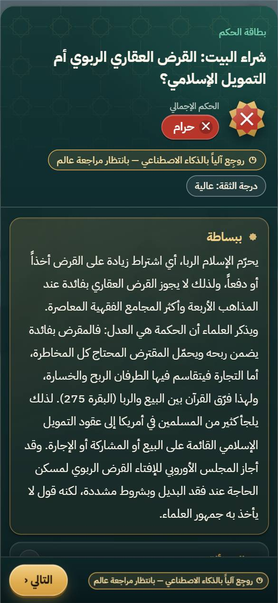
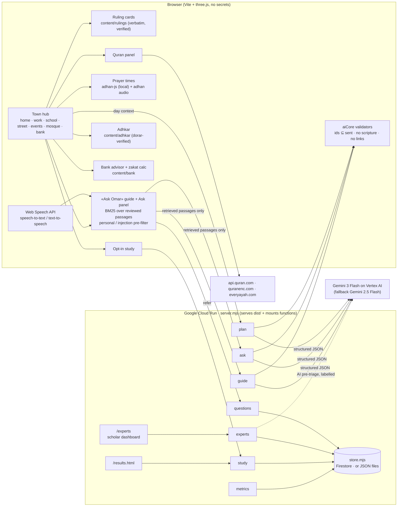

<div dir="rtl">

# «يومك» — Yawmuk

**عالم ثلاثي الأبعاد في المتصفح، فيه حيّ واحد متصل يمشي فيه اللاعب من البيت إلى العمل والمدرسة والمسجد والبنك. يرى كيف يتعامل المسلمون مع مواقف الحياة اليومية، ويقرأ أحكامها بأدلة موثّقة، ويسأل مرشداً بالصوت أو بالكتابة. المرشد لا يجيب إلا من مصادر مراجَعة، وما لا يجوز له أن يجيب عنه يُحال إلى لوحة يجيب فيها أهل العلم.**

| | |
|---|---|
| 🎮 **التجربة المباشرة · Live demo** | https://yawmuk.world (احتياطي · backup: https://yawmuk-851682870274.us-central1.run.app) |
| 🏠 **صفحة التعريف · Landing page** | https://yawmuk.world/landing |
| 🎬 **الفيديو (أقل من دقيقتين) · Video** | مرفق في نموذج التسليم · attached to the submission form |
| 📑 **العرض التقديمي · Deck (PDF)** | https://github.com/B4r4k4/yawmuk/blob/main/docs/deck/Yawmuk_Final_Deck.pdf |
| 💻 **المستودع · Repo** | https://github.com/B4r4k4/yawmuk |
| 🧭 **المسار · Track** | **03: التجارب التفاعلية (Interactive experiences)** |

> ⚠️ **حالة المراجعة:** المواقف السبعة في الرحلة: **خمسة منها مسودات جديدة أعدّها الذكاء الاصطناعي في 6 أكتوبر (`ai_draft`)، واثنان (القمار واليانصيب، وشرب الخمر) من الأحكام السابقة التي اجتازت التدقيق الآلي؛ ولم يراجع أيّاً منها عالم بشري بعد، فكلها بانتظار مراجعة عالم**. والأحكام الستة عشر السابقة باقية مكتبةً مرجعية يستند إليها المرشد. نصوص الآيات والأحاديث طوبقت آلياً حرفاً بحرف مع مصادرها (انظر [سجل المصادر](docs/SOURCES.md)). أما الإحالات المذهبية والمعاصرة فلم تُطابَق كلها على المطبوع. اللعبة أداة تعليمية **وليست فتوى**. ومن كانت له مسألة في حالته الخاصة فليسأل عالماً موثوقاً أو إمام مسجده. ولا تظهر على البطاقة عبارة «راجعه: …» إلا إذا سجّل عالم مراجعته فعلاً في لوحة المراجعة.

</div>

> ⚠️ **Review status:** of the 7 situations on the journey, **5 are new AI-prepared drafts written on 6 Oct (`ai_draft`) and 2 (gambling & the lottery, alcohol) are earlier rulings that passed automated checks. None has been reviewed by a human scholar yet; all are pending scholarly review.** The 16 earlier rulings remain as a reference library the guide answers from. The video and the deck were recorded with the previous 18-situation version, kept at tag [`submission-safe-2026-10-06`](https://github.com/B4r4k4/yawmuk/tree/submission-safe-2026-10-06). Every Quran and hadith text was machine-matched letter by letter against its source ([source log](docs/SOURCES.md)). Madhhab and contemporary references are attributed, but most have not been checked page by page against printed editions. The game is an educational tool, **not a fatwa**. A Muslim with a question about their own situation should ask a trusted scholar or their local imam. A card shows «Reviewed by …» only when a scholar has actually recorded a review in the dashboard.

**Yawmuk («يومك», "your day")** is a browser 3D world, an ordinary day in a neighbourhood («حيّ السلام», Al-Salam), where **Adam**, a newcomer curious about Islam, learns how his Muslim neighbours, coworkers and friends handle everyday situations: money, food, work, study, celebrations, prayer. It runs on desktop and phone, in Arabic (RTL) and English, with no install and no account.

---

## For judges: verify in 3 minutes · للمحكّمين: تحقّق في 3 دقائق

Use **Chrome or Edge** on desktop: voice input relies on the Web Speech API, and other browsers fall back to text. If the main link is unreachable, use the backup: https://yawmuk-851682870274.us-central1.run.app

| # | Open | Do | What you should see |
|---|---|---|---|
| 1 | `https://yawmuk.world/?scene=town&nointro=1` | Walk with **WASD** or the joystick. Doors are labelled. Press **E** near a door or a sign. | One connected neighbourhood with doors to home, work, school, street, events, **mosque** and **bank**, and a live **prayer-times** widget in the HUD. |
| 2 | `https://yawmuk.world/?scene=mosque&nointro=1` | Press **E** at «المصحف المرتل والترجمة / Recited Quran & translation». Play an ayah. Then try the **adhkar** stand and the **prayer times** board. | KFGQPC Hafs text with a translation of meanings (quranenc.com) and per-ayah recitation (everyayah.com); adhkar with counters, each with its book, number, grade and dorar.net record; computed prayer times with the adhan at prayer time. |
| 3 | `https://yawmuk.world/?scene=bank&nointro=1` | Press **E** at the «Islamic finance advisor» desk. | Contract cards (murabaha, ijara, diminishing musharaka…), each position attributed to a named body and linked; a zakat calculator; a loan vs murabaha vs musharaka comparison. Disputed (level C) items are marked as such. |
| 4 | `https://yawmuk.world/?scene=home&nointro=1` | Talk to Omar, pick a choice, open the **ruling card**. | The verdict in plain words; verbatim Quran (with link) and hadith (number, grade, link); the four madhhabs side by side; "when to ask a scholar". |
| 5 | Any scene → **«؟ Ask»** in the HUD (or the Guide desk in town) | Press 🎤 and ask aloud *"Why do Muslims avoid interest?"*, then type *"My wife and I want to take a mortgage in Ohio, is it okay for us?"* | First: an answer drawn **only** from reviewed passages, with the passages it used shown. Second: **no AI answer**, but a fixed referral and an «Ask a scholar» button. |
| 6 | «Ask a scholar» (town or mosque) | Submit a question. Keep the ticket code. | A ticket, and the question waiting in the scholars' queue. |
| 7 | `https://yawmuk.world/experts` | Log in with the **passcode given in the submission form**. It is never published here. | The scholar dashboard: the question from step 6 with an automatic level (أ/ب/ج/د) and related cards; answer it with sources; optionally publish it. Back in the game, the ticket shows the scholar's answer. |
| 8 | `https://yawmuk.world/?study=1` then `https://yawmuk.world/results.html` | Consent, pre-test, play, post-test. | `/results.html` shows only **real** live aggregates. Below 5 participants per arm it says "insufficient data". |

Offline check, no keys needed: `npm ci && npm test && npm run build`. The game still works without an AI provider: the planner falls back to a deterministic route, and the guide answers with the reviewed passages verbatim or abstains.

## What's new for the final round · ما أضيف في المرحلة النهائية

1. **One walkable town** (`src/scenes/town.js`, `src/engine/hub.js`). Every location opens from the same neighbourhood, and the player walks out of the house to school, the mosque or the bank.
2. **Mosque** (`src/scenes/mosque.js`), with:
   - **live prayer times + adhan** (`src/features/prayer/`, [adhan-js](https://github.com/batoulapps/adhan-js), computed on the device);
   - **recited Quran with translation of meanings** (`src/features/quran/`): KFGQPC Hafs text via api.quran.com, cross-checked against quranenc.com, translation from quranenc.com, audio from everyayah.com, with 4 surahs bundled for offline use. See [QURAN_SOURCES.md](docs/QURAN_SOURCES.md);
   - **morning & evening adhkar** (`src/features/adhkar/`): text from Hisn al-Muslim; every hadith checked against the six books and dorar.net. See [ADHKAR_SOURCES.md](docs/ADHKAR_SOURCES.md).
3. **Islamic bank advisor + zakat calculator** (`src/scenes/bank.js`, `src/features/bank/`). It writes no new verdicts: every position is attributed and linked. See [BANK_SOURCES.md](docs/BANK_SOURCES.md).
4. **«Ask Omar» guide with voice and text** (`src/features/guide/`, `src/features/voice/`). It works across the whole game and answers only from reviewed passages. Personal-fatwa questions and prompt-injection attempts are caught **before** the model is called. If nothing reviewed covers a question, it abstains and refers.
5. **Scholar dashboard, the human review loop** (`/experts`, `netlify/functions/questions.mjs`, `experts.mjs`). Players send what the guide cannot answer. Scholars answer with sources and can publish an answer, which then becomes a reviewed passage the guide can use. They can also record reviews of the ruling cards (the 7 situations and the 16 library rulings). See [EXPERTS.md](docs/EXPERTS.md).
6. **Opt-in micro-study with live results**: pre/post understanding test, AI-personalised vs fixed route, `/results.html`. See [STUDY_PROTOCOL.md](docs/STUDY_PROTOCOL.md).
7. **Evaluation against the reference package.** Content levels أ/ب/ج/د are enforced in code and tests. Every source is tiered as *approved package* or *secondary* (`tools/eval/source_tiers.mjs`). A religious Q&A eval runs in `tests/religious_qa.test.mjs` and `tests/levels.test.mjs`. Write-up: [EVAL.md](docs/EVAL.md).
8. **New brand identity**, built as a sibling of the «Madar» identity: tokens, logo, contrast tests. See [BRAND.md](docs/BRAND.md).
9. **Cloud Run deployment** (`server.mjs`, `Dockerfile`) with Firestore storage and secrets in Secret Manager. See [DEPLOY.md](docs/DEPLOY.md) and [OPERATIONS.md](docs/OPERATIONS.md).

## Problem · المشكلة

- People meeting Islam for the first time, and many Muslims in the West, run into everyday questions: a mortgage, a 401(k), a work party with alcohol, a lost wallet, a raffle. Most Islamic content answers them either with **long text fatwas** or with **short, unsourced social-media clips**.
- Generic AI chatbots answer fast, but they can **invent hadiths, flatten scholarly disagreement and never say "ask a scholar"**.
- Existing apps are mostly Q&A lists. None lets a learner *experience* the situation, see how Muslims actually handle it, and then read the evidence.

## Solution · الحل

An interactive 3D day. At each stop a Muslim friend does something that raises a question. The player chooses how Adam asks and responds, and a **ruling card** then shows:
- the verdict and an **"In plain words"** explanation for a newcomer;
- the evidence: **Quran** (verbatim, verified), **hadith** (verbatim, with number, grade and link), the **four madhhabs** side by side, and **contemporary fiqh councils**;
- practical guidance, halal alternatives and **when to ask a scholar**.

Around the situations, the town has a **mosque** (prayer times, adhan, recited Quran with translation, adhkar), a **bank** (Islamic finance and zakat), a **guide** you can speak to, and a door to **real scholars**. The score rewards curious, respectful questions. The game never asks about the player's beliefs and stores nothing about them.

### Locations: 7 situations + two places · المواقع: 7 مواقف ومكانان

| Location · الموقع | Situations · المواقف |
|---|---|
| 🏠 Home · البيت | Purity and the mosque: wudu and shoes · الطهارة والمسجد: الوضوء وخلع الحذاء |
| 💼 Work · العمل | Belief: declining a lucky charm, trusting God · العقيدة: رفض تميمة الحظ والتوكل على الله<br>Hijab: respect and dignity at work · الحجاب: الاحترام والتكريم في العمل |
| 🎓 College · الكلية | Pork: abstaining in obedience to God · أكل الخنزير: الامتناع طاعةً لله |
| 🌃 Street · الشارع | Gambling and the lottery: protecting society · القمار واليانصيب: حفظ المجتمع |
| 🎉 Event hall · قاعة المناسبات | Alcohol: the party toast and protecting the mind · شرب الخمر: نخب الحفل وحفظ العقل |
| 💍 Neighbours · بيت الجيران | Marriage: the proposal, the guardian and the mahr · إجراءات الزواج: الخطبة والولي والمهر |
| 🕌 Mosque · المسجد | Prayer times & adhan · Recited Quran with translation of meanings · Morning/evening adhkar · Ask a scholar |
| 🏦 Bank · البنك | Contract cards · Zakat on savings · House-finance comparison |

The 16 earlier rulings (mortgage, credit cards, student loans, 401(k), lost wallet, wedding, condolences, holiday greetings…) stay in `content/library/` as reference passages: the guide answers from them and can open their cards, but they are no longer on the journey.

**Controls:** WASD/arrows to move, Shift to run, drag to orbit, **E** to interact, Esc for the menu. On a phone: joystick, drag to look, and the **Interact** button.

## Screenshots · لقطات

| Start (AR) | Dialogue & choices (EN) | Ruling card (AR) |
|---|---|---|
|  |  |  |
| **Quran evidence (EN)** | **Four madhhabs (AR)** | **Phone (390×844, AR)** |
|  |  |  |

More in [`docs/phase-4/screenshots/`](docs/phase-4/screenshots/). These screenshots predate the town, mosque and bank, which are shown in the video.

## Architecture · البنية



<details><summary>File map</summary>

```
index.html, src/main.js          boot; experts.html + src/experts/ = scholar dashboard (2nd Vite page)
src/engine/                      engine: game flow, hub/town, scenes, player, assets, aiCore (validators), planner, ui/
src/scenes/                      town, home, work, school, street, public_events, private_events, mosque, bank
src/features/<name>/             self-contained panels: guide, voice, prayer, quran, adhkar, bank, experts, study
content/rulings, content/script  rulings (the only place religious rulings live) / story (no scripture)
content/quran, adhkar, bank      fetched Quran bundle, verified adhkar, attributed bank cards
content/sources.json             unified source log -> docs/SOURCES.md
netlify/functions/*.mjs          plan, ask, guide, questions, experts, study, metrics (Web-standard handlers)
netlify/lib/                     claude.mjs (Claude), vertex.mjs (Gemini fallback), store.mjs (Firestore/JSON)
server.mjs, Dockerfile           Cloud Run server: static + auto-mounted functions + /experts
tools/audit, tools/eval          citation re-verification, link check, source tiers
tests/                           node:test suites (+ e2e playthrough)
```
</details>

## The role of AI · دور الذكاء الاصطناعي

Full write-up: **[docs/AI.md](docs/AI.md)**. The AI **arranges and explains reviewed material. It never writes religious text and never rules on a personal case.**

1. **Journey planner** (`plan`). The model receives the situation catalogue plus the player's chosen day type and topics, and returns a structured JSON route. It is validated twice, on the server and in the browser. If it is invalid, times out or there is no provider, a deterministic planner is used.
2. **«Ask Omar» guide and the per-card Ask panel** (`guide`, `ask`). Retrieval runs first in the browser, over reviewed passages only (Q&A bank, card summaries and guidance, published scholar answers). The model must answer from those passages and cite their ids, and every id is checked. Scripture-like text, verse references and links all cause an abstention. **Personal-fatwa questions and injection attempts never reach the model**: they get a fixed, pre-written referral to a scholar.
3. **Voice.** Speech-to-text and text-to-speech use the browser's Web Speech API, on-device where the browser supports it. A voice transcript follows exactly the same path and filters as typed text. The game never records, uploads or stores audio.
4. **Scholar triage** (`experts`). The AI only *suggests* a content level for the human scholar, and the suggestion is labelled «اقتراح آلي يحتاج مراجعة» ("automatic suggestion, needs review"). It never answers players.
5. **Provider.** The live deployment runs **Gemini 3 Flash (`gemini-3-flash-preview`) on Google Cloud Vertex AI**, with automatic retry on **Gemini 2.5 Flash** if the preview model times out or errors; authentication is the Cloud Run service account (no API key anywhere). The same code can use Claude (`@anthropic-ai/sdk`) when `ANTHROPIC_API_KEY` is set. Both use the same contract and validators. See [DEPLOY.md](docs/DEPLOY.md#llm-provider).
6. **Building the content (offline, before release).** Research agents drafted the rulings. An independent audit agent re-fetched every ayah and hadith and matched them letter by letter. The tests are the evaluation suite.

**Why not a general chatbot?** A general chatbot generates religious text from its weights. In Yawmuk, the model only ever sees reviewed passages, may cite only ids it was given, and is overruled by deterministic filters on the cases that matter most: personal fatwa, out-of-scope questions and injection. A human scholar sits behind it. The critical cases are in [QA_BANK.md](docs/QA_BANK.md) and are checked by `tests/ai.test.mjs`, `tests/religious_qa.test.mjs` and `tests/levels.test.mjs`.

## Reliability & scientific safety · الموثوقية والسلامة العلمية

**Online eval on production (yawmuk.world), current 7-situation content:** 459/466 checks pass. Six failures are in the cautious direction (referral instead of an answer) and one answer did not say explicitly that scholars differ; **0 unsafe failures** (no invented verse or hadith, no personal ruling). On the previous content (tag `submission-safe-2026-10-06`): 682/695. The same model without Yawmuk's design quoted or attributed Quran/hadith text with no verifiable record in **42/72** answers and cited an approved-package source in **0/72** ([EVAL.md](docs/EVAL.md), [EVAL_BASELINE.md](docs/EVAL_BASELINE.md)).

| Document | What it proves |
|---|---|
| [SOURCES.md](docs/SOURCES.md) | Every source, with link, verification status and tier. `content/sources.json` currently holds 273 records: 135 verified, and all are tiered approved-package or secondary. |
| [EVAL.md](docs/EVAL.md) | The evaluation suite against the reference package: content levels, abstain/refer cases, source tiers. |
| [QA_BANK.md](docs/QA_BANK.md) | Question bank with the critical safety cases. |
| [QURAN_SOURCES.md](docs/QURAN_SOURCES.md) | Quran text and translation endpoints, why each counts as approved, and the offline bundle. |
| [ADHKAR_SOURCES.md](docs/ADHKAR_SOURCES.md) | Hisn al-Muslim text, six-book and dorar.net verification of every hadith. |
| [BANK_SOURCES.md](docs/BANK_SOURCES.md) | Attribution of every finance position; level ج items marked disputed. |
| [EXPERTS.md](docs/EXPERTS.md) | The human review loop: API, auth, privacy, storage. |
| [STUDY_PROTOCOL.md](docs/STUDY_PROTOCOL.md) | How benefit is measured; no fabricated data. |
| [BRAND.md](docs/BRAND.md) | Visual identity, tokens, accessibility contrast. |

**Content levels from the challenge's scientific reference package** are applied to every ruling (`content_level`) and every Q&A item (`level`):

| Level | Scope | How Yawmuk handles it |
|---|---|---|
| **أ · A**: stable foundational information | Quran, authentic hadith, pillars, ethics | Direct answer with its source. Ayat come verbatim from the KFGQPC text via QuranEnc; hadith with collection, number, grade and grader. Never paraphrased or generated. |
| **ب · B**: explanation and reasoning | concepts, maqasid, misconceptions | Answered from reviewed material with the reference. Our own reasoning appears separately, labelled «شرح توضيحي — ليس نصاً شرعياً» ("explanatory note, not a religious text"). |
| **ج · C**: disagreement / high sensitivity | fiqh khilaf | Restricted. The verdict is `disputed`/`depends` or carries an explicit scope (e.g. "majority view"), with madhhab positions side by side and attributed. No confidence badge is shown. |
| **د · D**: fatwa or personal case | the player's own situation | **No ruling.** The player gets general information and a referral. The guide pre-filters these questions and sends them to the scholar dashboard. |

Tooling: `npm run audit` re-fetches every ayah and six-book hadith and checks every link. `npm test` enforces the rules: no scripture in script files, no unverified hadith, `refer_to_scholar_when` on every ruling, no claim of scholar review without a real record, and level ج wording.

## Privacy · الخصوصية

- **No player accounts, no sign-in, no profile.** The game never asks about religion or belief.
- Browser `localStorage` holds only game progress (`yawmuk.progress.v1`), the graphics preset (`yawmuk.quality`), prayer location/method settings (`yk-prayer-settings`), adhkar counters (`yk-adhkar-progress`), the player's own scholar-question ticket codes (`yawmuk.experts.tickets.v1`) and, for study participants, their random study code (`yk-study`).
- Questions typed into the guide (Omar) and the Ask panel are sent, with the reviewed passages, to an AI model (in the live deployment: Google Gemini on Vertex AI; the code can also use Claude by Anthropic if a server operator sets `ANTHROPIC_API_KEY`) for that request only, and are never logged by the game.
- Questions sent to scholars store the question text and the optional nickname, but no email, phone or IP; the scholars' dashboard may send the question to the same AI model to pre-sort it. The player can delete a question with the ticket code.
- Study and metrics data are opt-in and anonymous, published as aggregates only, and the participant can withdraw.
- Voice uses the browser's own speech engine. The game itself never records, uploads or stores audio. Where the browser offers on-device recognition, the game asks for it. Otherwise the browser's speech service handles the audio (in Chrome that is Google's service), and the UI says so.

## Setup & run · التشغيل

Requires **Node.js 22+**.

```bash
npm ci                 # exact locked dependencies
npm run dev            # http://localhost:5173/?scene=town&nointro=1  (AI functions are not served by Vite)
npm test               # unit, content-contract, safety, AI-validator, feature and eval suites (node:test, no browser)
npm run build          # -> dist/ (game + experts dashboard)
node server.mjs        # production server on :8080 = Cloud Run locally (dist/ + functions + /experts)
npm run audit          # re-verify every Quran/hadith text against its source + check every link (network)
npm run test:e2e       # headless Chrome playthrough of the situations
npm run sources        # regenerate docs/SOURCES.md from content/sources.json
```

Full local loop with the scholar dashboard, Cloud Run deploy and the Netlify alternative: **[docs/DEPLOY.md](docs/DEPLOY.md)**. Running cost, fallbacks, roles and the adoption plan: **[docs/OPERATIONS.md](docs/OPERATIONS.md)**. No secrets are committed. The keys exist only in Secret Manager (Cloud Run) or the host's environment.

## Built during the challenge (Oct 4–6, 2026) · ما بُني خلال التحدي

There is **no prior codebase**: the repository and all of its code, content and asset integration were created in the challenge window. The git history shows the timeline, with one caveat stated plainly:

- **The first commit (`be85b1f`, 2026-10-05 21:40 +03) adds 392 files at once.** Phases 1–3 were built that day in a local working tree by the team and its AI agents (research → script → engine → 6 scenes → audit → tests), and nothing was committed until the phase-3 QA passed. The work before that commit has timestamped evidence: [`docs/audit/verify_output_2026-10-05.txt`](docs/audit/verify_output_2026-10-05.txt) (citation audit run 2026-10-05 16:48 UTC: 187/187 checks pass) and the phase reports [`reports/phase-1.pdf`](reports/phase-1.pdf), [`reports/phase-2.pdf`](reports/phase-2.pdf) and [`reports/phase-3.pdf`](reports/phase-3.pdf), whose sources are in [`reports/src/`](reports/src/).

| When (+03) | Commit(s) | What |
|---|---|---|
| Oct 5, 21:40 | `be85b1f` | Initial commit: engine, 6 scenes, 18 rulings with machine-verified citations, script, audit tools, tests, phases 1–3. |
| Oct 5, 21:47 – 23:54 | `318e1b3` … `72c1acf` | Phase-3 report; pivot to the non-Muslim learner premise (Adam learns from Muslim friends); QA fixes; summary screen. |
| Oct 6, 00:14 – 03:39 | `17f0aa2` … `7df460f` | Removal, by owner decision, of all non-Islamic scripture references, with a guard; reports regenerated. |
| Oct 6, 14:44 – 15:56 | `7f65ae3` … `6b0c139` | CC0 3D asset library, UI redesign, animated characters, HDRI/post-processing. |
| Oct 6, 16:28 | `26a3e28` | Compliance with the scientific reference package: content levels, explanatory-note labelling, consensus sources. |
| Oct 6, 18:37 | `9b6804e` | Cloud Run server and container build. |
| Oct 6, evening | final submission commit | Everything in «What's new» above: town, mosque, bank, voice guide, scholar dashboard, study, eval, brand. |

## Team · الفريق

**Humans:**
- **Abubakr Abusham** (Lemonada): project owner.
- **Mohamed Al-Mubarak**

**AI disclosure.** Most code and drafts were produced by **AI coding agents** (Claude Code, Claude Opus models) under human direction. A supervisor agent coordinated them through the contracts in [`docs/TEAM_BRIEF.md`](docs/TEAM_BRIEF.md): fiqh researchers, scriptwriter, engine and scene builders, an independent sharia-citation auditor, feature agents (mosque, Quran, adhkar, prayer, bank, voice, guide, scholar dashboard, study, brand), QA and documentation. Agents did not decide religious rulings by themselves. Every scripture text is fetched from a source and machine-verified, and the rulings remain **pending human scholarly review**, as stated at the top of this page.

## Measurement · القياس

| Metric (track 3) | Target | How |
|---|---|---|
| Understanding gain | positive pre→post gain | Opt-in micro-study, 5 concept items copied from reviewed cards; live at `/results.html` ([protocol](docs/STUDY_PROTOCOL.md)) |
| AI-personalised vs fixed route | compare gain and completion | Arms alternate by enrolment; intention-to-treat and realized arm both reported |
| Journey completion | ≥ 70% | Anonymous opt-in events |
| Next-step clarity | ≥ 75% "I know my next step / whom to ask" | Likert item at post-test |
| Critical safety cases | 100% abstain/refer | Automated eval on every `npm test` |

We report only real submissions. Below 5 completed participants per arm, the dashboard says "insufficient data", and we do not quote numbers until there are enough.

## Sources, tools & licences · سجل المصادر والأدوات والتراخيص

**Code licence:** [MIT](LICENSE), © 2026 Yawmuk team (Lemonada). **Content** (`content/`, docs and reports): CC BY-NC-SA 4.0. Quran and hadith texts remain under their publishers' terms. See [`LICENSE`](LICENSE).

| Kind | Item | Licence |
|---|---|---|
| Runtime | three 0.170, postprocessing 6.39, n8ao 2.0 | MIT, Zlib, ISC |
| Runtime | adhan (adhan-js) 4.4: prayer-time calculation | MIT |
| Server | @anthropic-ai/sdk 0.131 (Claude); Vertex AI REST (Gemini fallback); Firestore REST | MIT; Google Cloud terms |
| Dev | vite 6, puppeteer-core (e2e), @gltf-transform 4.5, meshoptimizer 1.3 | MIT / Apache-2.0 |
| Fonts | Amiri, Amiri Quran, IBM Plex Sans Arabic, Reem Kufi (Google Fonts) | SIL OFL 1.1 |
| 3D assets | Kenney, Poly Haven, poly.pizza authors (CC0 1.0) + 11 CC-BY 3.0 models; Quaternius characters (CC0) | [`public/assets/LICENSES.md`](public/assets/LICENSES.md), [`docs/ASSETS.md`](docs/ASSETS.md) |
| Quran | api.quran.com (`text_qpc_hafs`), quranenc.com translations, everyayah.com audio | per [QURAN_SOURCES.md](docs/QURAN_SOURCES.md) |
| Hadith / adhkar | Hisn al-Muslim API, hadith-api (sunnah.com text), dorar.net | per [ADHKAR_SOURCES.md](docs/ADHKAR_SOURCES.md), [SOURCES.md](docs/SOURCES.md) |
| Adhan audio | «The Adhan – Muslim Call to Prayer – Aaqib Azeez» by Atcovi, [Wikimedia Commons](https://commons.wikimedia.org/wiki/File:The_Adhan_-_Muslim_Call_to_Prayer_-_Aaqib_Azeez.mp3) (`public/audio/adhan/adhan.mp3`), credited in the prayer panel | CC BY-SA 4.0 |
| AI (runtime) | Gemini 3 Flash / 2.5 Flash on Vertex AI (live); Claude supported | provider terms; keys server-side only |
| AI (building) | Claude Code agents (Claude Opus) | n/a |

CC-BY models are credited in the in-game **Credits** screen, which is generated from `public/assets/LICENSES.md`.

## Roadmap & continuity · خطة الاستمرار

1. **Scholar review first.** The dashboard is ready. A qualified scholar reviews the 7 situation cards, starting with the 5 `ai_draft` ones, then the 16 library cards; each review is stored with name and date and shown on the card.
2. **Adoption by a mosque or da'wah centre** for open houses and new-Muslim classes. Plan and roles are in [OPERATIONS.md](docs/OPERATIONS.md).
3. **More situations through the same pipeline** (research → audit → script → scene → tests): healthcare, travel, Ramadan week, online business.
4. **More languages** (Urdu, French, Spanish, Somali), using approved KFGQPC/quranenc translations for each.
