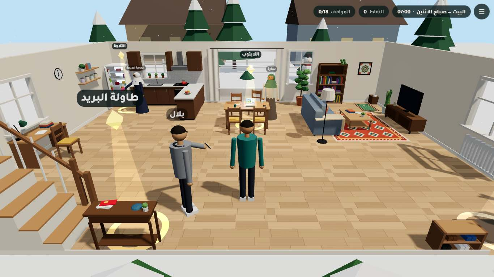
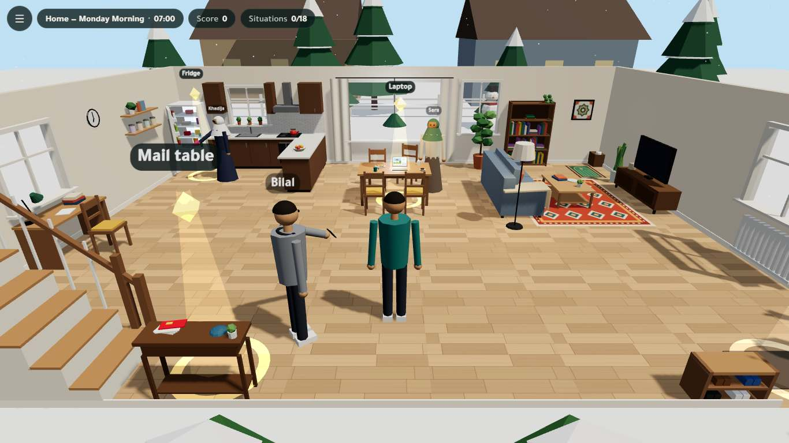
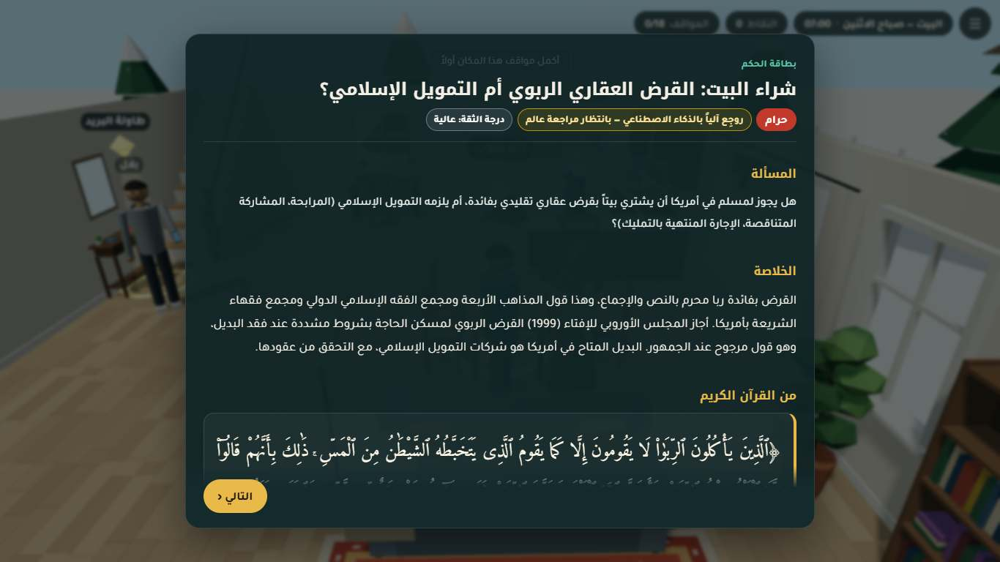
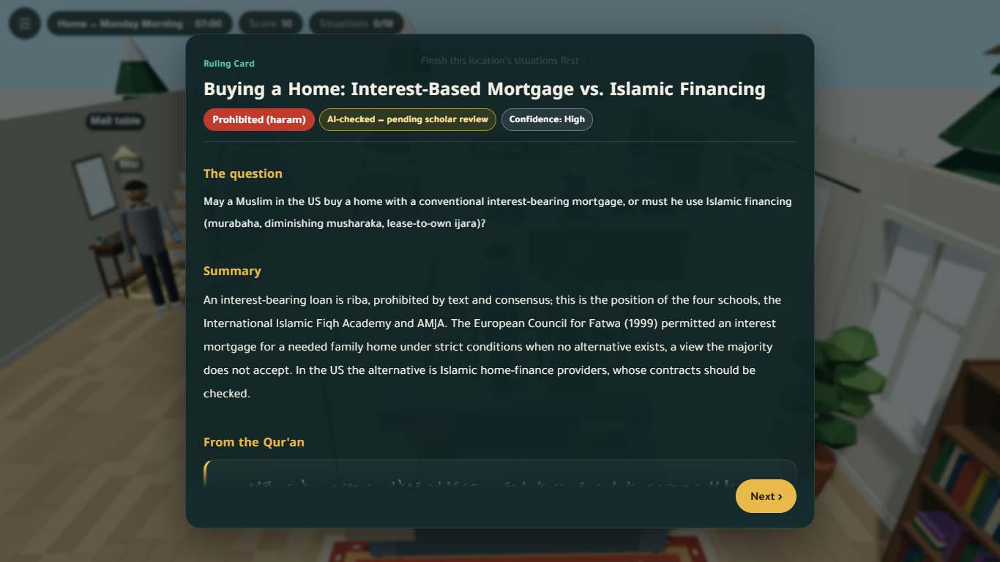
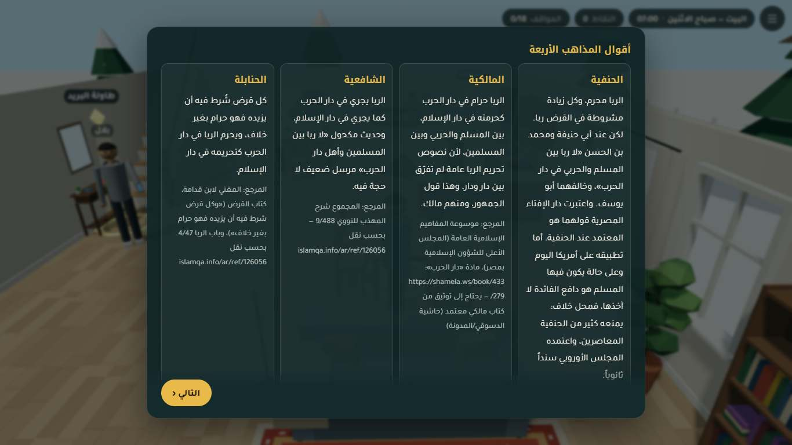
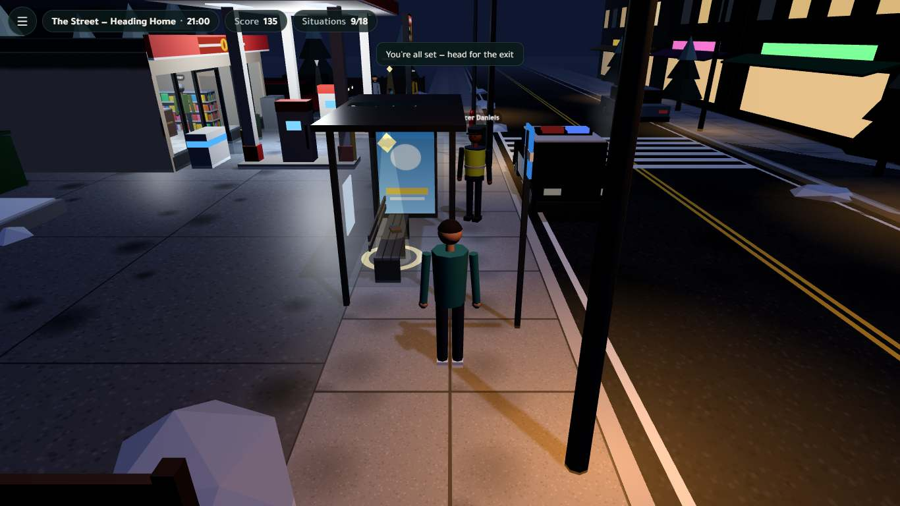
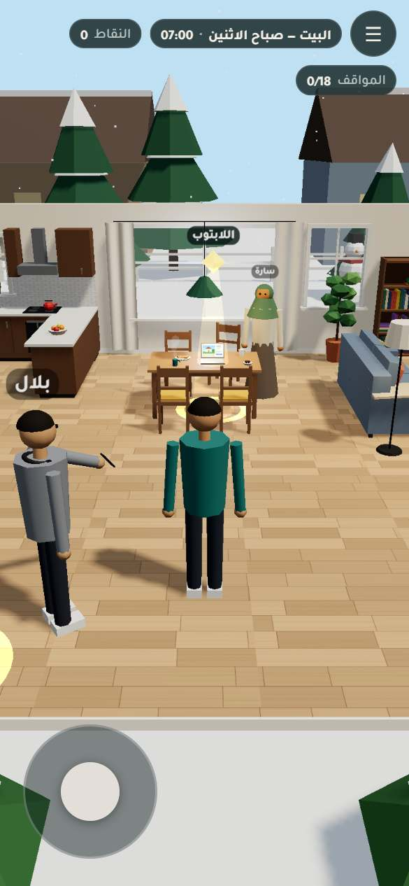
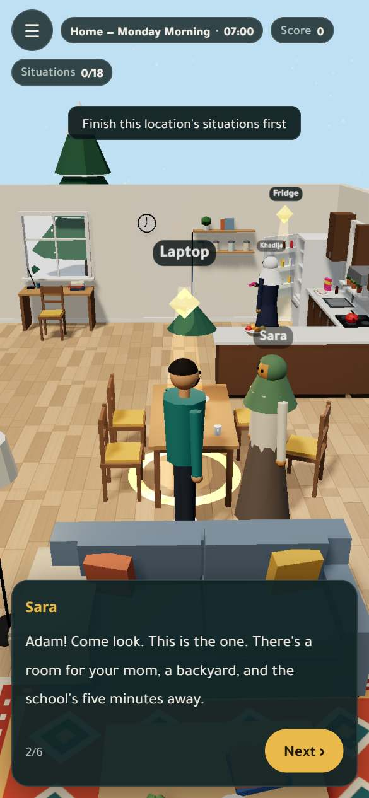

<div dir="rtl">

# «يومك» — Yawmuk

**لعبة ثلاثية الأبعاد في المتصفح عن فقه المعاملات اليومية للمسلم في أمريكا.**
تعيش يوماً كاملاً مع «آدم»، مهندس برمجيات مسلم في كولومبس، أوهايو. في كل محطة من المحطات الست يواجه موقفاً حقيقياً: قرض عقاري، أو وظيفة في مطعم، أو امتحان، أو محفظة ضائعة، أو حفلة الشركة، أو عرس صديق. تختار ما تفعله، ثم تظهر لك **بطاقة حكم** فيها الأدلة من القرآن والسنة، وأقوال المذاهب الأربعة، وقرارات المجامع الفقهية المعاصرة، ومتى تسأل عالماً.

> ⚠️ **حالة المراجعة:** الأحكام الثمانية عشر **مسودات أعدّها الذكاء الاصطناعي وراجعها آلياً**، وهي **بانتظار مراجعة عالم بشري**؛ لم يراجعها أي عالم بعد. نصوص الآيات والأحاديث طوبقت آلياً حرفاً بحرف مع مصادرها (انظر [سجل المصادر](docs/SOURCES.md))، أما الإحالات المذهبية والمعاصرة فلم تُطابَق كلها على المطبوع. اللعبة أداة تعليمية **وليست فتوى**. لحالتك الخاصة اسأل عالماً موثوقاً أو إمام مسجدك.

</div>

**Yawmuk («يومك», "your day")** is a browser 3D game (desktop and phone, Arabic RTL and English) about the Islamic fiqh of everyday dealings for a Muslim living in the USA. You spend one day with Adam, a junior software engineer in Columbus, Ohio. At each of six locations you face real situations: a mortgage, a restaurant side job, an exam, a lost wallet, the office holiday party, a friend's wedding. You choose what to do, then a **ruling card** shows the evidence from the Quran and Sunnah, the four madhhabs, contemporary fiqh councils, practical guidance, halal alternatives, and when to ask a scholar.

> ⚠️ **Review status:** all 18 rulings are **AI-prepared drafts that passed automated checks; they are pending scholarly review and have not been reviewed by a human scholar.** Every Quran and hadith text was machine-matched letter by letter (with harakat) against its source (see the [source log](docs/SOURCES.md)). Madhhab and contemporary references were checked for consistency, but most were not matched page by page against printed editions. The game is an educational tool, **not a fatwa**. For your own situation, ask a trusted scholar or your local imam.

---

## Screenshots

| Arabic, desktop | English, desktop |
|---|---|
|  |  |
|  |  |
|  |  |

| Phone (390×844), Arabic | Phone, English |
|---|---|
|  |  |

All 250+ screenshots from the automated playthrough are in [`docs/phase-3/screenshots/`](docs/phase-3/screenshots/): every scene, dialogue, choices, ruling card, check question and the final summary, in both languages, on desktop and phone.

## The six stops and 18 situations · المحطات الست والمواقف الثمانية عشر

| Stop · المحطة | Situations · المواقف |
|---|---|
| 🏠 Home, 07:00 · البيت | Mortgage vs Islamic financing · Supermarket meat, gelatin, alcohol in flavorings · Credit cards & BNPL |
| 💼 Work, 10:00 · العمل | Serving alcohol/pork at a side job · 401(k) & employer match · Vendor gifts, timesheets, company resources |
| 🎓 College, 18:30 · الكلية | Cheating & AI-written assignments · Interest-bearing student loan · Mixed study groups & handshakes |
| 🌃 Street, 21:00 · الشارع | Lost wallet (luqata) · Lottery, scratch cards, sports betting · Hidden defects, tips, fake reviews |
| 🎄 Office holiday party · حفلة الشركة | Christmas/Thanksgiving greetings · A table where alcohol is served · Charity raffle |
| 💍 Neighbors & a wedding · الجيران والعرس | A Muslim friend's wedding · Death of a non-Muslim neighbor · Gifts & a child's birthday party |

## Play · كيف تلعب

- **Desktop:** WASD or arrow keys to move, Shift to run, drag the mouse to orbit, wheel to zoom, **E** to interact, Esc for the menu.
- **Phone:** virtual joystick, drag to look, the **Interact** button.
- Walk to a glowing marker, talk, choose (choices are shuffled every time), read the ruling card, answer the check question (+5). "Try another choice" replays a situation; the score keeps your best. The exit opens once a location is done. Progress is saved in your browser (localStorage) and you can continue later.

## Run, build, test · التشغيل والبناء والاختبار

Requires **Node.js 22+**.

```bash
npm install
npm run dev            # http://localhost:5173  (?scene=home&nointro=1&lang=en&debug=1 to jump straight in)
npm run build          # -> dist/ (static, base './': works from any host or sub-path)
npm run serve:dist     # serve dist/ with a tiny zero-dependency static server: http://127.0.0.1:4173
npm test               # unit, content-contract and safety tests (node:test, no browser needed)
npm run test:e2e       # headless Chrome playthrough of all 18 situations, AR+EN, desktop+phone
npm run audit          # re-verify every Quran/hadith text against its source + check every link (needs network)
npm run sources        # regenerate docs/SOURCES.md from content/sources.json
```

### What the tests cover

| Suite | File | What it checks |
|---|---|---|
| Content contract | `tests/content.test.mjs` | The 18 ids match the catalog in `docs/TEAM_BRIEF.md` and the engine; every ruling and script field exists in both languages; every script `ruling_id` exists; hotspots exist in `docs/hotspots.md` and in the scene; exactly one `best` choice (with the most points) per situation; exactly one correct check answer; the location chain ends in `null`. |
| Safety | `tests/safety.test.mjs` | Every ayah has surah/ayah, verbatim text, translation and a quran.com link, and is marked verified in the source log. Every hadith has collection, number, narrator, grade and an https source; six-book hadiths are machine-verified and others are documented in `tools/audit/manual_verifications.json` (**no unverified hadith**). No empty madhhab entry without a reviewer note. Every ruling has `refer_to_scholar_when`. `review_status` never claims scholar review. **No script file contains Quran or hadith text.** The ruling-card renderer **abstains** (a "content pending" card, "text not provided") rather than inventing text, renders citations verbatim with attribution, and never renders unsafe links. |
| Citation audit | `tests/audit.test.mjs` | Runs `tools/audit/verify.mjs` (re-fetches every ayah from quran.com + Tanzil and every six-book hadith from hadith-api and compares them letter by letter). Uses the download cache in `tools/audit/.cache/`; **skipped with a message** when offline with no cache. |
| End to end | `tests/e2e/playthrough.mjs` | Serves `dist/` statically (no Vite), drives local headless Chrome via `puppeteer-core`, and plays the whole day 4 times (AR/EN × desktop/390×844 touch). It checks console errors, real scenes (no placeholder or auto-placed hotspot), every hotspot and exit reachable on foot (grid search with the player's collision rules), the E key and the touch Interact button, dialogue, choices, points, every ruling card section against the JSON, the check question, "try another choice", the revisit menu, the language switch, the exit lock, location transitions, localStorage resume after a reload, the final summary (score = maximum), and horizontal overflow (RTL). It writes screenshots and `docs/phase-3/e2e_results.json`. Options: `--only=desktop-en`, `--no-shots`, `--camera` (camera occlusion sweep), `E2E_GL=swiftshader` for machines with no GPU. |

Latest results are in [`docs/phase-3/qa_report.md`](docs/phase-3/qa_report.md).

## Deploy (static) · النشر

`dist/` is a static site with relative paths and no server code. **Nothing has been deployed yet.**

- **GitHub Pages:** push the repo, then add `.github/workflows/pages.yml` that runs `npm ci && npm run build` and publishes `dist/` with `actions/upload-pages-artifact` + `actions/deploy-pages`, and set *Settings → Pages → Source: GitHub Actions*. Or build locally and push `dist/` to a `gh-pages` branch: `git subtree push --prefix dist origin gh-pages` (remove `dist/` from `.gitignore` on that branch). Because `base: './'`, it works under `https://<user>.github.io/<repo>/`.
- **Netlify:** "Add new site → Import from Git", build command `npm run build`, publish directory `dist`. Or drag and drop the `dist/` folder onto app.netlify.com/drop. No redirects are needed (single page, no router).
- Any static host (Cloudflare Pages, Vercel static, S3) works the same way. The only external request is Google Fonts; the game falls back to system Arabic fonts without it.

## Architecture · البنية

```
index.html, src/main.js         boot
src/engine/                     game engine (Three.js r170, Vite 6) — see src/engine/README.md
  game.js                       flow: start → intro → 6 locations → summary; window.yawmuk debug API
  sceneManager.js               validates the scene contract, places markers/NPCs, camera occluders, disposal
  player.js, input.js, world.js third-person player, keyboard/mouse/touch, renderer + light presets
  content.js                    loads content/*.json at build time (raw + JSON.parse: bad JSON never breaks the build)
  ui/                           dialogue sheet, ruling card (text only via textContent), screens, HUD
src/scenes/<location>.js        six procedural scenes (primitives + canvas textures, no model files)
content/rulings/<location>.json the rulings: the ONLY place religious content lives
content/script/<location>.json  the fictional story: dialogue, choices, check questions (no Quran/hadith text)
content/sources.json            unified source log (generated) → docs/SOURCES.md
tools/audit/                    verify.mjs (citation checker), links.mjs, build_sources.mjs, sources_md.mjs
tools/serve.mjs                 zero-dependency static server for dist/
tests/                          node:test suites + e2e playthrough
docs/                           team brief, story bible, hotspots, research notes, audits, phase reports
reports/phase-N.pdf             phase reports
```

Key principles from the brief, enforced in code and tests:
1. **Story and ruling are separate.** Dialogue is fiction. Rulings and evidence come only from `content/rulings/`, and the engine renders them without changing a word.
2. **No fabrication.** A Quran or hadith text is quoted only verbatim from a verified source, with its number, grade and link. If a text could not be verified, the field stays empty, the card says "not provided", and the reason goes in `notes_for_reviewer`.
3. **Disagreement is shown honestly:** the four madhhabs side by side, plus contemporary councils (IIFA, MWL Fiqh Council, AMJA, Fiqh Council of North America, ECFR).
4. **Referral:** every ruling says when to ask a scholar (or another specialist).
5. **Arabic RTL and English** throughout, including the ruling card.

## Content & sourcing methodology · منهجية المحتوى والتوثيق

1. **Research agents** wrote each ruling from primary sources: the Quran (Uthmani text from quran.com, Sahih International translation), hadith (sunnah.com and dorar.net, with number and grade), the relied-upon books of each madhhab or the Kuwaiti Fiqh Encyclopedia, and contemporary council resolutions. Notes are in `docs/research/`.
2. **An independent audit agent** (`docs/audit/phase1_audit.md`) re-fetched every ayah (api.quran.com + Tanzil) and every six-book hadith (hadith-api, the same text sunnah.com shows) and compared them **letter by letter, with harakat**: 27/27 unique ayat and 64/64 hadith citations matched. Three hadiths outside the six books were matched by hand and logged. The agent corrected 7 rulings and logged open questions for a scholar.
3. **The source log** (`content/sources.json` → [`docs/SOURCES.md`](docs/SOURCES.md)) lists all 209 sources: 92 verified (all Quran and hadith texts plus 7 contemporary resolutions) and 117 that still need a human (madhhab page references and most fatwas).
4. **The scriptwriter** never writes scripture. Situations point to a `ruling_id`, and the tests enforce this.
5. **Review status:** `ai_verified` (14 rulings) means "passed the automated checks and the AI auditor found no substantive error". `ai_draft` (4 rulings: food ingredients, alcohol/pork job, wedding, gifts/birthday) means "open questions for a scholar". Both show in the game as **"pending scholar review"**. Only a human scholar's review may change this. The prioritized list for the reviewer is in `docs/audit/phase1_audit.md` §4.

## Team of agents · فريق الوكلاء

Built by a team of AI agents coordinated by a supervisor agent, under the contracts in [`docs/TEAM_BRIEF.md`](docs/TEAM_BRIEF.md):

| Agent | Output |
|---|---|
| Supervisor | brief, contracts, coordination |
| Fiqh research (×3) | `content/rulings/*.json`, `docs/research/*` |
| Scriptwriter | `content/script/*.json`, `docs/story_bible.md`, `docs/hotspots.md` |
| Engine | `src/engine/**`, `index.html`, build setup |
| Scene builders (×6) | `src/scenes/*.js` |
| Independent sharia auditor | `tools/audit/*`, `content/sources.json`, `docs/audit/*` |
| Integration & QA | `tests/**`, `tools/serve.mjs`, this README, `docs/phase-3/qa_report.md` |
| Documentation | `reports/phase-*.pdf` |

## Roadmap · خارطة الطريق

1. **Scholar review (first priority):** a qualified scholar reviews the 18 rulings, starting with the 4 `ai_draft` ones and the prioritized list in the audit, and checks madhhab references against printed editions. Approved rulings get `review_status: "scholar_reviewed"`, with the reviewer's name and date. The safety test will then need a list of the approved ids.
2. **Ramadan expansion:** a "Ramadan in America" day (suhoor before work, iftar invitations, zakat al-fitr, i'tikaf and work, fasting and exams), built with the same pipeline (research → audit → script → scene → tests).
3. **AI guided Q&A layer (per the brief):** a "ask about this situation" panel that answers **only** from the verified ruling JSON. It would use constrained retrieval over `content/rulings` + `content/sources.json`, require the model to return **structured JSON** (claim → `ruling_id` / citation id), validate every citation id against the source log before showing the answer, and **abstain and refer to a scholar** when no source covers the question. The safety tests here (abstention, attribution, no fabricated hadith) become its evaluation suite.
4. Accessibility pass (screen-reader flow for the 3D parts, captions), more languages (Urdu, French, Somali), audio narration, and a teacher mode for Islamic schools and MSAs.
5. Demo video (planned).

## License · الترخيص

**TODO (team decision):** no license has been chosen yet. Until one is added, all rights are reserved. Suggested: MIT for the code, and CC BY-NC-SA 4.0 for `content/`. Quran text and translations remain under their sources' terms (quran.com / Tanzil / Sahih International), and hadith texts link to sunnah.com and dorar.net.
